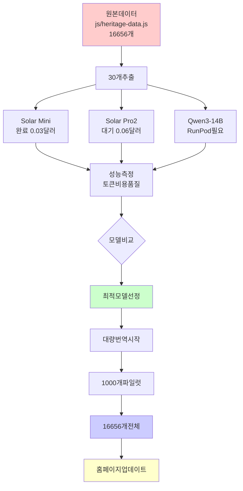
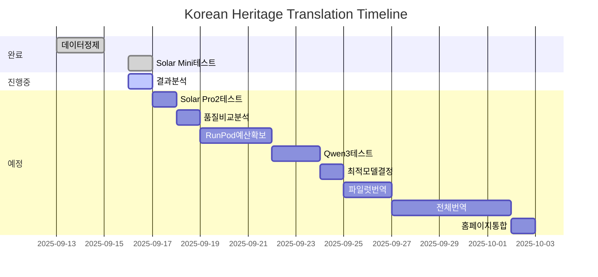

# 번역 워크플로우

## 🔄 처리 흐름

```mermaid
flowchart TD
    A[원본데이터<br/>js/heritage-data.js<br/>16656개] --> B[30개추출]
    
    B --> C[Solar Mini<br/>완료 0.03달러]
    B --> D[Solar Pro2<br/>대기 0.06달러]
    B --> E[Qwen3-14B<br/>RunPod필요]
    
    C --> F[성능측정<br/>토큰비용품질]
    D --> F
    E --> F
    
    F --> G{모델비교}
    G --> H[최적모델선정]
    H --> I[대량번역시작]
    I --> J[1000개파일럿]
    J --> K[16656개전체]
    K --> L[홈페이지업데이트]
    
    style A fill:#ffcccc
    style H fill:#ccffcc  
    style K fill:#ccccff
    style L fill:#ffffcc
```

markdown
# 프로젝트 일정

## 📅 타임라인

```mermaid
gantt
    title Korean Heritage Translation Timeline
    dateFormat YYYY-MM-DD
    
    section 완료
    데이터정제        :done, clean, 2025-09-13, 2d
    Solar Mini테스트  :done, mini, 2025-09-16, 1d
    
    section 진행중
    결과분석         :active, analysis, 2025-09-16, 1d
    
    section 예정
    Solar Pro2테스트 :pro2, 2025-09-17, 1d
    품질비교분석     :compare, after pro2, 1d
    RunPod예산확보   :budget, 2025-09-19, 3d
    Qwen3테스트      :qwen, after budget, 2d
    최적모델결정     :decide, after qwen, 1d
    파일럿번역       :pilot, after decide, 2d
    전체번역         :full, after pilot, 5d
    홈페이지통합     :deploy, after full, 1d
```
